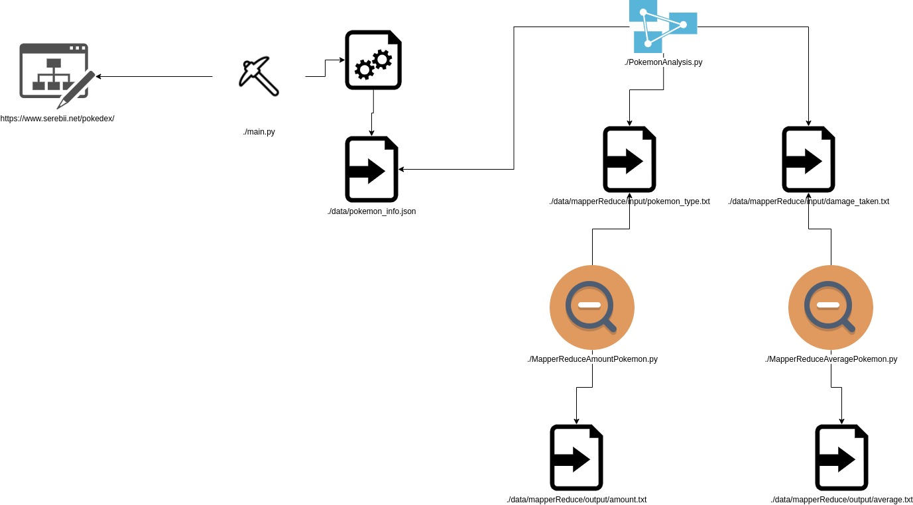

# Extração e processamento de Pokémons

## Requisitos:
É necessario ter a versão do Python 3.8 instalado para rodar o projeto.

## Como rodar:
1. Crie um ambiente virtual python: `python3 -m venv ./venv`
2. Ative o ambiente virtual: `source ./venv/bin/activate`
3. Instale as dependencias: `pip install -r requirements.txt`
4. Rode o arquivo main: `scrapy runspider main.py`
5. Rode o arquivo PokemonAnalysis: `python PokemonAnalysis.py`
6. Rode o arquivo MapperReduceAmountPokemon: `python MapperReduceAmountPokemon.py ./data/mapperReduce/input/pokemon_type.txt > ./data/mapperReduce/output/amount.txt`
7. Rode o arquivo MapperReduceAveragePokemon: `python MapperReduceAveragePokemon.py ./data/mapperReduce/input/damage_taken.txt > ./data/mapperReduce/output/average.txt`

## Arquitetura:
